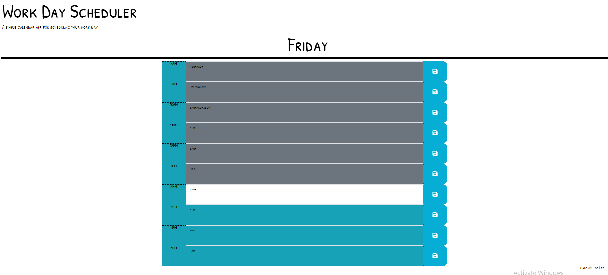

# Day-Scheduler

## Description
This is a simple day scheduler created using HTML, JavaScript, CSS and BootStrap. 
  
You are able to enter your own events and save it for your needs. 
 
Simply click on the empty box and type away! 
 
When you're done, click on the save icon located at the right of the box. 
 
Events that are saved will stay even if you close it or refresh by accident. 
  
This scheduler is also color coded, showing which time block you are in. 
 
Past events will show up dark, future will show up as blue. 
 
Future events will show up white to ensure best reading. 
  
You may delete your items individually or simply click on the "clear" button. 
 
Please note, you will not be able to bring back items that you've "cleared. 

## Technologies
In order to create this scheduler, the following 3rd party API's were used. 
- fontawesome: icons (save) 
- googlefonts: font ('Patrick Hand SC')
- momentjs: timer (to produce day of the week) 

## Deployment
Website is currently deployed on Git Pages: 

https://jollypong.github.io/day-scheduler/

## Repository
Repository can be accessed at: 

https://github.com/jollypong/Day-Scheduler

Repository contains: 
- index.html
- README.md 
- assets (folder)
  - image(folder
    - screenshot.png
  - script.js 
  - style.css
     
## Screenshots

## Contribution
Joe Lee @ https://github.com/jollypong